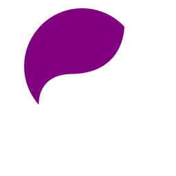
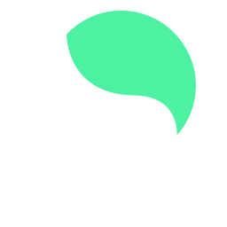

<!-- _footer: Estevão Mascarenhas -->

# **Neurodiversity**

What is it about and why you should care.

---

# This talk is about **people**

---

# 0.0008%

---

#### Dinousaurs ruled the Earth
 ~174 million years

 

#### Humans have been around

 150.000~200.000 years

 

### <strong>0.0008%</strong>

<!-- _footer: https://www.livescience.com/3945-history-dinosaurs.html -->

---

<!-- _footer: https://www.bloomberg.com/news/articles/2013-05-09/a-terrifying-fascinating-timelapse-of-30-years-of-human-impact-on-earth -->

---

<!-- _backgroundColor: white -->
<!-- _color: black -->

# Collaboration

We can do amazing things **together**

---

<!-- _backgroundColor: white -->
<!-- _color: black -->

We can't even build a **pencil**
without our modern interdependence

<small>(really, go look for it)</small>

---

### Successful collaboration 

Intelligence + ? + ?

---

# Communication

<small>We collaborate only because we communicate</small>

---

### We imagine a future, discuss it and then
### build it, together

---

## Our communication is complex

---

<!-- _backgroundColor: white -->
<!-- _color: black -->

Spoken language
Voice tone
Facial expressions
Gestures
Body posture
Eye gaze
(...)

---

<!-- _backgroundColor: white -->
<!-- _color: black -->

Speak loud or soft
Look into the eyes or away
Physically close or distant

---

"I feel comfortable around this person, so I have no problem looking at their eyes"

---

"I will be present and dedicate all my attention in this conversation, because I care about it"

---

<!-- _backgroundColor: white -->
<!-- _color: black -->

"This person is looking into my eyes while speaking, 
I <strong>feel</strong> trust"

---

<!-- _backgroundColor: white -->
<!-- _color: black -->

"This person seems present and listening to me, 
I <strong>feel</strong> good talking to them"

---

<!-- _backgroundColor: white -->
<!-- _color: black -->

"This person looks distracted and not listening to me,
that <strong>bothers</strong> me"

---

---

### We all behave and make sense of behavior

### when communicating

---

### Often it provoke emotions

---

"This person seems present and listening to me, 
I <strong>feel</strong> good talking to him/her"

"This person looks distracted and not listening to me, that <strong>bothers</strong> me"

---

### But often we forget one important fact...

---

### Despite our life experience,

### the culture we lived in...

---

---

### ...we can also have different brains

---

<!-- _backgroundColor: white -->
<!-- _color: black -->
<!-- _class: -->

# Neurodiversity

### neu·​ro·​di·​ver·​si·​ty

 

The range of differences in individual brain function and behavioural traits, regarded as part of <strong>normal variation</strong> in the human population.

---

### ADHD Autism Dyslexia
### Dispraxya Synesthesia Dyscalculia
### ...

---

<!-- _backgroundColor: white -->
<!-- _color: black -->
<!-- _class: -->

## Disclaimer

Neurodivergency does not mean **disability**.
It only acknowledges the fact that we can be very different.

If you struggle with some aspect of your life while being neurodivergent, please seek help and don't be ashamed by it.

---

### You probably know some amazing 
### neurodivergents

---

<!-- _backgroundColor: white -->
<!-- _color: black -->

<small>

> I can forgive his writing, though it is the worst I have ever seen, and I try to view tolerantly his unswerving inexactitude and slipshod, dirty, work, inconsistent though such inexactitude is in a utilitarian; but I cannot forgive the stupidity of his attitude towards sane discussion on the New Testament.

</small>

---

<!-- _class: invert -->

### Alan Turing

<small>

<small>That is a quote from an English teacher report on Turing during his time at school.</small>

<small>Specialists suspects he was in the autism spectrum, based on strong biographic evidence.</small>

<small>Turing is the father of theoretical computer science.</small>

</small>

---

<!-- _backgroundColor: white -->
<!-- _color: black -->

<small>

> Having ADHD, and taking medicine for it is nothing to be ashamed of, nothing that I'm afraid to let people know. 

</small>

---

<!-- _class: invert -->

### Simone Biles

<!-- _footer: https://w.wiki/3Ppv -->

<small>

<small>Simone won four gold medals in gymnastics in 2016 Rio Olympics.</small>

<small>She stood up when hackers leaked her medical records.</small>

</small>

---

<!-- _backgroundColor: white -->
<!-- _color: black -->

"Cool... but why should I care that much? 
There is only few people, right?"

---

### 1 of 5 people you meet throughout your life
### is a neurodivergent

---

### Research estimates that 15-20% of the world 
### population can be considered neurodivergent

<!-- _footer: https://academic.oup.com/bmb/article/135/1/108/5913187 -->

---

<!-- _backgroundColor: white -->
<!-- _color: black -->

### Neurodiversity is about inclusion

---

<!-- _backgroundColor: white -->
<!-- _color: black -->

### If we don't include them, we're missing their unique abilities and perspectives

---

### Successful collaboration 

Intelligence + Communication + ?

---

<!-- _backgroundColor: white -->
<!-- _color: black -->

### Intelligence + Communication + <b>Difference</b>

---

Imagine if you had to colaborate with people that only think about things in the way you do.

---

<!-- _backgroundColor: white -->
<!-- _color: black -->

"Okay, how can I apply this knowledge?"

---

## **Empathy**

---

<!-- _class: invert -->

## Expand your Empathy

 

<small>

Some people can communicate better through written medias. (Do you really need to have that meeting?)

Some people can be too literal, so try to avoid assuming intentions and prefer to ask directly.

Act mindful on schedule changes, communicate clearly and in advance.

</small>

---

<!-- _class: invert -->

## Expand your Empathy

 

<small>

How can you prevent unnecessary distractions for others around you? Some people have higher sensorial sensitivity.

The person didn't look into your eyes? Maybe that's not about trust or confidence.

</small>

---

### This talk is about <strong>people</strong>

---

If can expand our empathy towards others, 
and undertand that it is not only okay for us to be different. 

It's essential part of our species success.

---

My hope is that one day we won't need to have words to classify people.

First we need to stop assuming people is broken from the start.

---

## Thank you